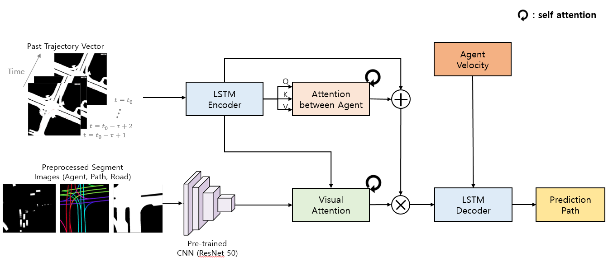
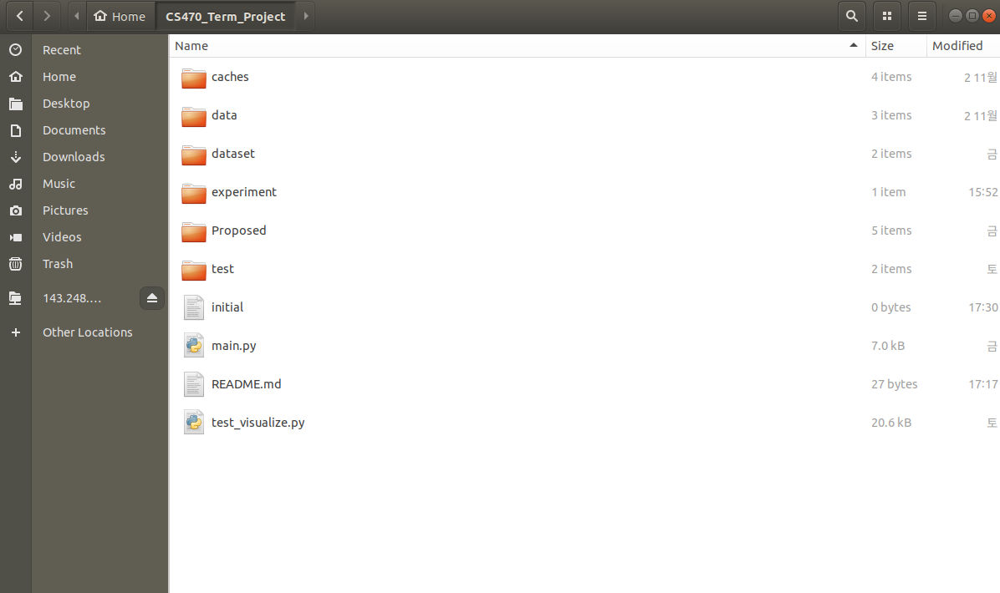
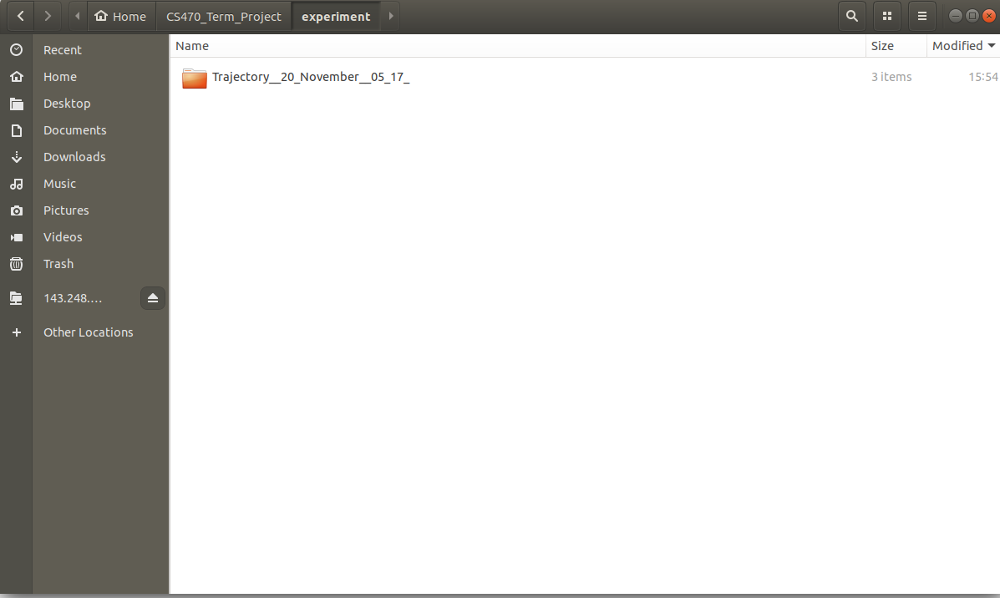
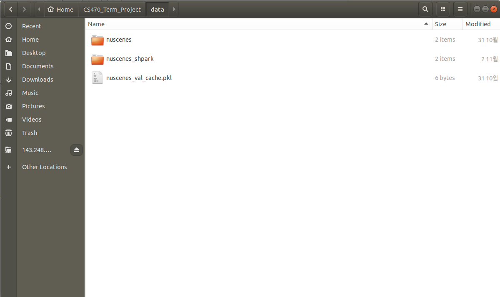
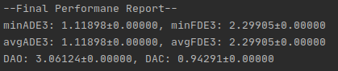
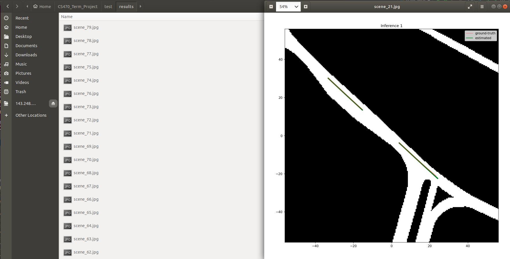

# CS470-TEAM4-TERM-PROJECT
It is a model that predicts the trajectory of the Vehicle by using deep learning. 




We used Attention, LSTM, etc. to solve various problems of existing MTP. The path is generated for all the agents on the image, not for one agent. 

## Directory Setting
<center></center>
<center></center>
<center></center>

If the train or test (visualization) is to be carried out smoothly, the form of the directory should be as shown in the figure above.
When the git was first clone, there would not be an experiment and data folder, which was uploaded separately using drive because of its large capacity.
It is important to note that the data folder should be unzip so that there is no additional data folder in the data folder.

## Dataset
https://drive.google.com/file/d/1nf8w2YCTlLGRb_HbrB6cW1TXp3rEJoq6/view?usp=sharing

You can download dataset through link.
We recommend using the dataset we provide because we used the nuscene dataset by processing.


## Trained Model
https://drive.google.com/file/d/18MgeVviFO9e4zpctcg3T314BQ_6--2t5/view?usp=sharing

Because the trained model also has a large capacity, you need to download it through drive link.
If you unzip just like the directory picture, it will work without any problems.

## Requirements
For the convenience of users, the conda environment has been copied. If you use this environment as it is, you will be able to use it without having to download additional libraries.
```
conda env create -f CS470_environment.yml
conda activate new_py
```

## Training
You can train with simple commands like the following by setting the required argumentss on 'main.py' in advance.
```
python3 main.py
```


## Testing
We stored about 80 printed images in '/test/results' in advance. However, if you want to print a new images and see the ADE, FDE results, you can see the new 80 imagess and the following results with the command below.



```
python3 test_visualize.py
```

## See the results



